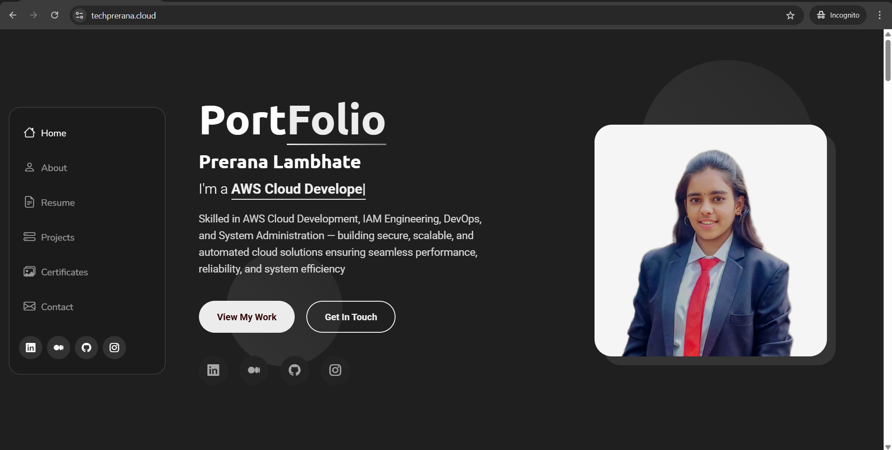

# Portfolio Deployment using AWS S3, CloudFront and Custom Domain

This project demonstrates how to deploy a **static portfolio website** using **AWS S3 + CloudFront CDN + ACM SSL + Custom Domain (Hostinger)**.

The portfolio is publicly accessible at:

https://www.techprerana.cloud

This setup provides a **secure, scalable, and production-ready hosting architecture**.

# Architecture

User  
↓  
CloudFront (CDN + HTTPS)  
↓  
AWS S3 (Static Website Hosting)

# Technologies Used

- AWS S3 – Static website hosting
- AWS CloudFront – CDN distribution
- AWS Certificate Manager (ACM) – SSL certificate
- Hostinger – Domain & DNS management
- GitHub – Source code repository

# Deployment Steps

## 1 Upload Portfolio to AWS S3

1. Create an S3 bucket.
2. Upload portfolio files (HTML, CSS, JS, assets).
3. Enable **Static Website Hosting**.
4. Set:
    Index document: index.html

## 2 Create CloudFront Distribution

1. Open **AWS CloudFront**
2. Create a new **distribution**
3. Select S3 bucket as **origin**
4. Set:
    Viewer protocol policy → Redirect HTTP to HTTPS
    Default root object → index.html

## 3 Create SSL Certificate (ACM)

1. Go to **AWS Certificate Manager**
2. Request a public certificate
3. Add domains:
    techprerana.cloud
    www.techprerana.cloud

4. Use **DNS validation**
5. Add the provided **CNAME record** in Hostinger DNS.

## 4 Configure CloudFront with Custom Domain

In CloudFront settings:

Add **Alternate Domain Names (CNAME)**
    www.techprerana.cloud

Attach the **ACM SSL certificate**.

## 5 Configure DNS in Hostinger

Update DNS records:
    Type: CNAME
    Name: www
    Points to: d1mj1vlei-----.cloudfront.net

This connects the custom domain to CloudFront.

## Live Website

#  Final Result

✔ Portfolio deployed on AWS  
✔ Custom domain connected  
✔ HTTPS enabled  
✔ Global CDN via CloudFront  
✔ Production-ready static hosting

#  Live Website

https://www.techprerana.cloud

# Author

**Prerana Lambhate**

Aspiring **Cloud & DevOps Engineer**

